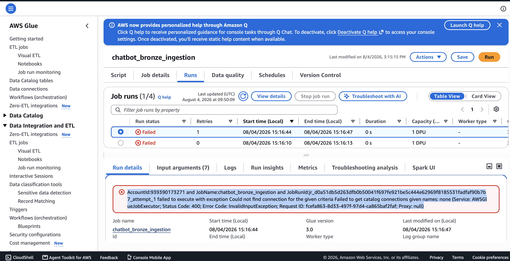
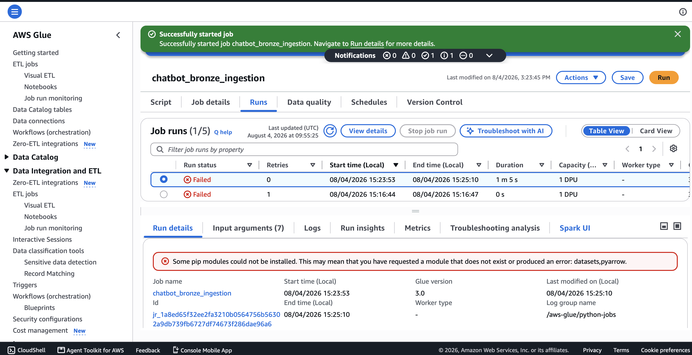
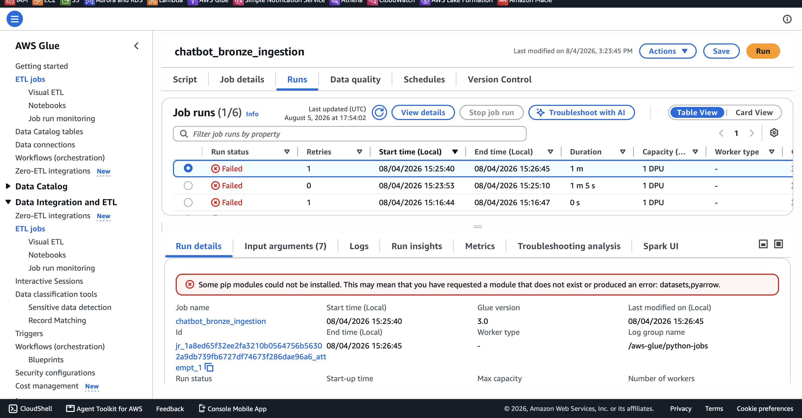
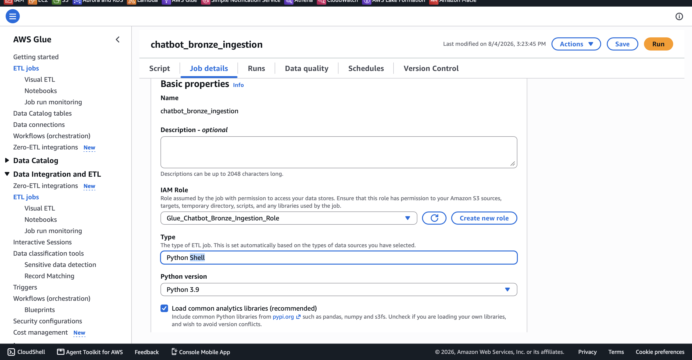
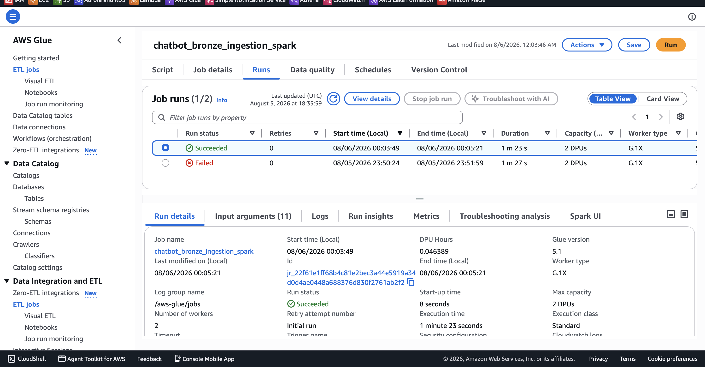

# Troubleshooting Log — Bronze Ingestion Job

Real errors hit while building `chatbot_bronze_ingestion`, in the order they happened. Kept as a permanent record — this is genuine debugging, not a clean happy path, and it's worth showing that in an interview.

---

## Error 1 — ConcurrentRunsExceededException

```
Failed to start job
[gluestudio-service.us-east-1.amazonaws.com] startJobRun: ConcurrentRunsExceededException:
Concurrent runs exceeded. (Service: AWSGlue; Status Code: 400;
Error Code: ConcurrentRunsExceededException)
```

**No screenshot** — this one showed up as a banner message, not a full-page error.

**What caused it:** Glue only allows one active run of a job at a time by default. An earlier run (triggered before the real script had even been pasted in) was still sitting in the run history in a non-final state, blocking a new run from starting.

**Fix:** opened the **Runs** tab, confirmed the earlier run had actually finished (not genuinely stuck), then retried **Run**.

**Lesson:** always check the Runs tab before assuming a new failure — sometimes the "error" is just a leftover run from an earlier, incomplete attempt.

---

## Error 2 — Stale "None" connection



```
Could not find connection for the given criteria
Failed to get catalog connections given names: none
(Service: AWSGlueJobExecutor; Status Code: 400; Error Code: InvalidInputException)
```

**What caused it:** the job's **Connections** field (under Job details, separate from the IAM role) had a literal "None" entry selected, as if it were a real Glue Connection. Glue tried to look up a connection actually named "none" in the Data Catalog, found nothing, and failed before the script ever ran.

**Fix:** Job details → Connections section → removed the "None" entry entirely (this job needs zero Glue Connections — it talks to Hugging Face over the public internet and S3 via the IAM role, not a database).

**Lesson:** an empty-looking dropdown can still be "selected as None" rather than genuinely blank — worth explicitly clearing it, not assuming empty means unset.

---

## Error 3 — pip install failure (`datasets`, `pyarrow`)




```
Some pip modules could not be installed. This may mean that you have requested
a module that does not exist or produced an error: datasets,pyarrow.
```

**What caused it:** AWS Glue does not support compiling native code inside the job environment. `pyarrow` is a compiled (C++) library, and `datasets` pulls in a long chain of dependencies on top of it. Python Shell's environment is intentionally minimal and couldn't reliably resolve pre-built wheels for this combination — happened twice, on two separate days, confirming it wasn't a one-off fluke.

**Fix attempt that didn't work:** retrying the same job as-is (Python Shell engine) — failed identically both times.

**Real fix:** switched engine entirely to **Spark**, which has far more reliable pre-built wheel support for exactly this kind of heavier, data-science-style dependency set.

**Lesson:** Python Shell is fine for light scripts using built-in libraries only. Anything pulling pandas-adjacent or compiled dependencies → use Spark from the start, even for a "simple" ingestion script.

---

## Error 4 — Job engine type is locked after creation



**What caused it:** tried to switch the existing job's **Type** field from Python Shell to Spark directly in Job details. The field is read-only — Glue sets it automatically at the moment a job is first created and never allows changing it afterward.

**Fix:** created a brand new job (`chatbot_bronze_ingestion_spark`) from scratch, selecting **Spark script editor** at creation time instead of Python Shell. Same IAM role, same job parameter, reused without changes.

**Lesson:** engine choice is a one-time decision made at job creation — get it right up front, or budget for creating a second job rather than expecting to convert one in place.

---

## Error 5 — Gated dataset (`DatasetNotFoundError`)

```
Error Category: UNCLASSIFIED_ERROR; Failed Line Number: 20;
DatasetNotFoundError: Dataset 'lmsys/chatbot_arena_conversations' is a gated
dataset on the Hub. You must be authenticated to access it.
```

**No screenshot** — text-only error from the run's error summary.

**What caused it:** the official LMSYS dataset now requires a Hugging Face login and accepted license agreement to download — this had changed since the dataset was first chosen for this project.

**Fix:** swapped to an ungated third-party mirror of the same 33K conversations: `agie-ai/lmsys-chatbot_arena_conversations`. Same real data, no authentication required.

**Lesson:** public dataset access policies can change over time — always confirm a dataset is still open access right before building a pipeline around it, not just at initial research time. A more "production-correct" fix (Hugging Face token stored in Secrets Manager) remains a good follow-up exercise later.

---

## Resolution — Successful run



`chatbot_bronze_ingestion_spark` — **Succeeded**, 1m23s, 2 DPUs, 0 retries, Glue version 5.1. Confirmed file landed at `s3://ai-chatbot-platform-data/bronze/chatbot_conversations/chatbot_conversations.parquet`.

**Total errors hit before success: 5.** All five are documented above with root cause and fix — this sequence is a genuinely good story for an interview: it shows real troubleshooting across IAM, job configuration, environment limitations, and external data source changes, not just a working script on the first try.
