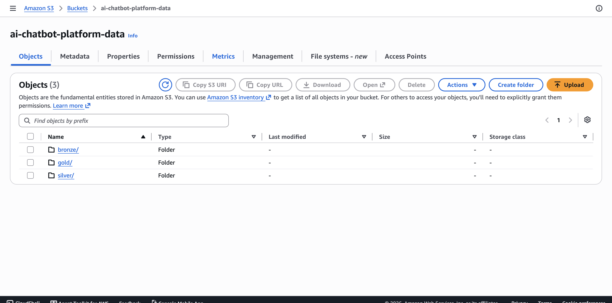

# Build Progress Log — AI Chatbot Data Platform

Running log of actual work done, in order, with evidence. Update this file every time a step is completed.

---

### Entry 1 — Buckets created

**Date:** August 2026
**Status:** ✅ Done

- Created `ai-chatbot-platform-data` (general purpose bucket) with three prefixes: `bronze/`, `silver/`, `gold/`
- Created `ai-chatbot-platform-vectors` as a dedicated **S3 Vector bucket**
  `arn:aws:s3vectors:us-east-1:939390173271:bucket/ai-chatbot-platform-vectors`

**What this proves:** the storage layer for the whole pipeline exists — three logically separated zones for the medallion layers, plus a dedicated store for embeddings, ready for the AI/ML team's similarity-search use case later.

**Why three folders instead of one:** each layer needs different access rules (DE writes Bronze, BI only reads Gold), different lifecycle policies (Bronze can expire sooner, Gold stays), and separated debugging (trace exactly which layer broke, instead of one undivided pile of files).

---

### Entry 2 — (next)

**Status:** ⬜ Not started

- Pull LMSYS Chatbot Arena Conversations dataset via the Hugging Face `datasets` library
- Convert to Parquet
- Upload to `s3://ai-chatbot-platform-data/bronze/`

---

## How to update this log going forward

Each new entry: date, status, what was done, a screenshot if there's a console action to show, and a one-line "what this proves." Keep it in order — this is the story of the build, not just a checklist.
