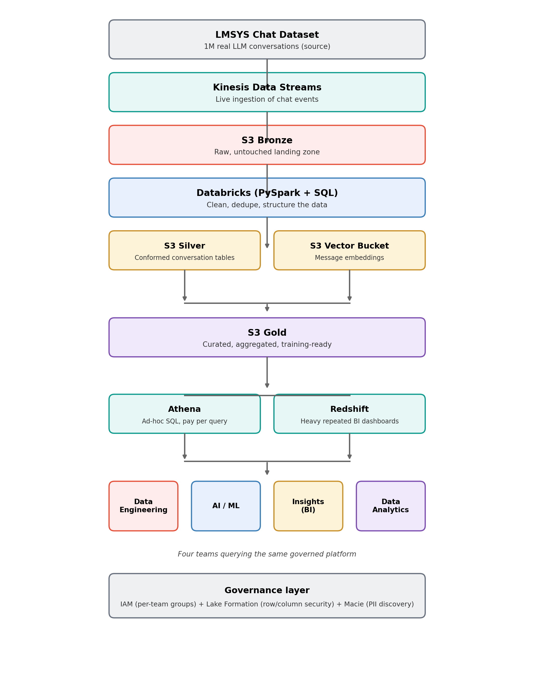

# AI Chatbot Data Platform — Production-Scale Pipeline

A production-scale data engineering project built with **AWS + Databricks**, designed the way a real AI chatbot company (ChatGPT/Claude-scale) would run its data ecosystem for four independent teams.

## Problem Statement

An AI chatbot company processes millions of conversations daily — messages, token usage, response latency, thumbs up/down feedback, safety flags, subscription tier, and model version. Leadership needs **one unified data platform** where four teams can each do their job independently, at scale, without stepping on each other or waiting on one another.

## The Four Teams

| Team | Job | What they need |
|---|---|---|
| **Data Engineering** | Builds and owns the pipelines | Raw ingestion, cleaning, dedup, schema management (Bronze → Silver → Gold) |
| **AI / ML** | Fine-tunes models, runs experiments | Curated training pairs, feedback signals, embeddings |
| **Insights (BI)** | Executive dashboards | Fast, repeated aggregation queries at scale |
| **Data Analytics** | Ad-hoc investigation | Flexible, exploratory SQL access |

## Source Data

[LMSYS-Chat-1M](https://huggingface.co/datasets/lmsys/lmsys-chat-1m) — 1 million real-world conversations with 25 LLMs, including model name, conversation text, language tag, and moderation flags. A smaller companion dataset, [Chatbot Arena Conversations](https://huggingface.co/datasets/lmsys/chatbot_arena_conversations) (33K conversations with human preference votes), is used for the feedback/BI use case.

```python
from datasets import load_dataset
ds = load_dataset("lmsys/chatbot_arena_conversations", split="train")  # start here — ungated
ds = load_dataset("lmsys/lmsys-chat-1m", split="train")                # full 1M, requires accepting terms
```

## Technology Stack

- **AWS** — Kinesis Data Streams, S3 (Bronze/Silver/Gold + Vector buckets), Glue Data Catalog, Athena, Redshift, IAM, Lake Formation, Macie
- **SQL** — CTAS, window functions, joins for Silver → Gold aggregation
- **Python** — dataset ingestion, Lambda functions, PySpark transformation logic
- **Databricks** — Auto Loader / Structured Streaming, Delta Lake (MERGE/UPDATE), Unity Catalog

## Architecture



Source dataset → Kinesis Data Streams → S3 Bronze → Databricks (PySpark + SQL transform) → S3 Silver + S3 Vector Bucket (embeddings) → S3 Gold → Athena / Redshift → four teams, governed throughout by IAM + Lake Formation + Macie.

## Build Plan (Status)

- [x] Problem statement defined
- [x] Technology stack selected
- [x] Architecture diagram designed
- [ ] Step 1 — Pull source dataset, land into S3 Bronze
  - [x] S3 buckets created (`bronze/`, `silver/`, `gold/` + Vector bucket)
  - [x] IAM role created (`Glue_Chatbot_Bronze_Ingestion_Role`, scoped to `bronze/*`)
  - [ ] Glue Python Shell job created and run
  - [ ] Dataset actually landed in `bronze/`
- [ ] Step 2 — Databricks Auto Loader ingestion + cleaning logic
- [ ] Step 3 — Silver layer: structuring, dedup, embeddings to S3 Vector bucket
- [ ] Step 4 — Gold layer: aggregations for BI, training-ready sets for AI/ML
- [ ] Step 5 — Athena + Redshift table setup for the four teams
- [ ] Step 6 — IAM groups/roles + Lake Formation row/column security + Macie scan
- [ ] Step 7 — End-to-end test + documentation

## Full Project Document

See [`AI_Chatbot_Data_Platform_Project.docx`](AI_Chatbot_Data_Platform_Project.docx) for the complete write-up.
