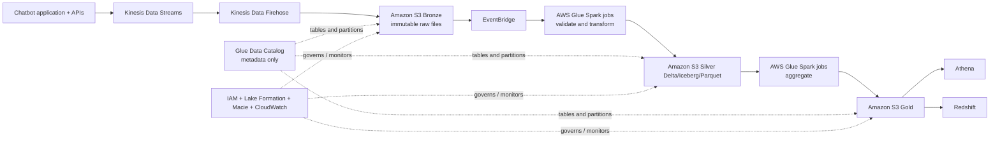

# AWS-native architecture boundary

This project intentionally keeps the processing and governance AWS-native:

The AWS build will document exactly when a Glue crawler is useful and when jobs must update table metadata/partitions explicitly.
