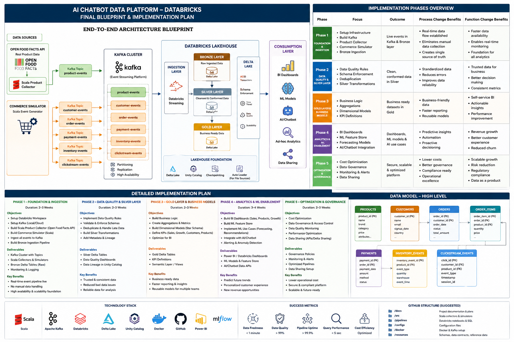

# Databricks E-commerce Data Platform

A Databricks-first streaming lakehouse project for sales, products, customers, inventory, BI, and machine learning.

## Final blueprint



## Core architecture

```text
Open Food Facts API → Scala product collector → Kafka product-events

Scala commerce simulator → Kafka customer/order/payment/inventory/clickstream topics

Kafka → Databricks Structured Streaming → Bronze → Silver → Gold

Gold → BI dashboards + ML models + AI applications
```

## Documentation

- [Final architecture blueprint](docs/architecture/FINAL_ECOMMERCE_BLUEPRINT.md)
- [All implementation phases](docs/implementation/ALL_PHASES_IMPLEMENTATION_PLAN.md)
- [Phase 1 detailed plan](docs/implementation/PHASE_1_DETAILED_PLAN.md)
- [Stakeholder summary](docs/stakeholder/PHASE_1_STAKEHOLDER_SUMMARY.md)
