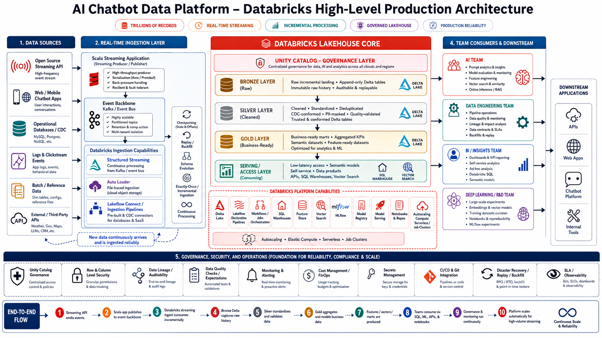

# Databricks AI and Data Platform - Production Portfolio

A Databricks-first, end-to-end lakehouse platform for high-volume streaming and batch data. The platform provides governed data products for four consumer groups:

- AI Engineering
- Data Engineering
- BI and Insights
- Deep Learning / R&D

## Business objective

Build a reliable, secure, observable data and AI platform that can scale from a portfolio prototype to very high event volumes without redesigning the core data model.

> "Trillions of records" is treated as a capacity and architecture target, not a benchmark claim. Actual throughput must be validated through load tests using realistic event size, skew, state, latency, and concurrency.

## High-level architecture



## Core flow

```text
Open-source streaming API
        |
Scala producer: validation, serialization, partition key, retries
        |
Kafka-compatible event backbone
        |
Databricks Structured Streaming / Lakeflow Pipelines
        |
Bronze Delta -> Silver Delta -> Gold Delta
        |
+----------------+----------------+----------------+----------------+
| AI Engineering | Data Platform  | BI / Insights  | Deep Learning  |
+----------------+----------------+----------------+----------------+
        |
SQL warehouses, feature tables, vector indexes, model serving, APIs
```

## Production principles

1. **Separate storage and compute** - Delta tables persist independently from ephemeral compute.
2. **Partition the event backbone** - scale throughput horizontally and preserve ordering only where required.
3. **Incremental by default** - process new events or files rather than repeatedly scanning full history.
4. **Idempotent processing** - safely replay events and recover failed micro-batches.
5. **Bronze as replay source** - immutable raw history supports rebuilding Silver and Gold.
6. **Data contracts and quarantine** - invalid records do not silently pollute trusted tables.
7. **Unity Catalog governance** - centralized access control, lineage, discovery, and auditability.
8. **Workload isolation** - streaming, batch, BI, and ML use independent compute policies.
9. **Observability as a product feature** - freshness, throughput, lag, quality, cost, and SLA metrics are monitored.
10. **Automated deployment** - environments are promoted through Git and infrastructure-as-code.

## Repository structure

```text
.
├── README.md
├── docs
│   ├── architecture
│   │   ├── HIGH_LEVEL_ARCHITECTURE.md
│   │   └── END_TO_END_FLOW.md
│   └── stakeholder
│       └── CDO_EXECUTIVE_BRIEF.md
├── infra
│   └── databricks
├── src
│   ├── scala-producer
│   ├── pipelines
│   │   ├── bronze
│   │   ├── silver
│   │   └── gold
│   ├── ai_ml
│   └── bi
├── config
│   ├── dev
│   ├── stage
│   └── prod
├── tests
│   ├── unit
│   ├── integration
│   └── data_quality
├── resources/images
└── .github/workflows
```

## Environment strategy

- **dev**: small synthetic streams, fast iteration, relaxed retention.
- **stage**: production-like schemas, security, replay, failure, and load testing.
- **prod**: isolated catalogs and credentials, strict policies, autoscaling where supported, on-call alerts, disaster recovery, and controlled releases.

Recommended Unity Catalog namespace:

```text
<environment>_<domain>.<layer>.<data_product>

prod_chatbot.bronze.raw_events
prod_chatbot.silver.conversation_events
prod_chatbot.gold.model_quality_daily
```

## Delivery roadmap

- Phase 1: architecture, repository, data contract, and local Scala producer
- Phase 2: event backbone and streaming Bronze ingestion
- Phase 3: Silver quality, deduplication, privacy, and sessionization
- Phase 4: Gold data products and semantic models
- Phase 5: AI features, embeddings, model lifecycle, and serving
- Phase 6: BI dashboards and stakeholder KPIs
- Phase 7: governance, security, observability, CI/CD, load tests, and DR

See [High-level architecture](docs/architecture/HIGH_LEVEL_ARCHITECTURE.md), [end-to-end flow](docs/architecture/END_TO_END_FLOW.md), and the [CDO brief](docs/stakeholder/CDO_EXECUTIVE_BRIEF.md).
