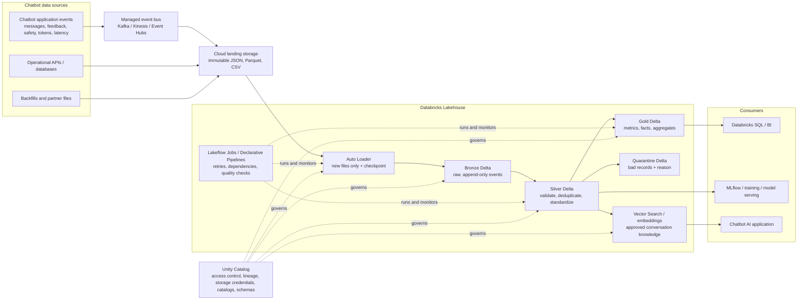

# Databricks-first architecture

## The simple mental model

**Files arrive once. Auto Loader remembers which files it has already processed. Delta tables hold the data. Pipeline code changes the data from Bronze to Silver to Gold. Unity Catalog governs every object.**

## What happens when a new event arrives

1. The chatbot application publishes an event. For streaming, an event bus batches events into landing files; for batch, a source system writes files directly to the landing location.
2. Auto Loader sees the new file through managed file events, reads it once, and records progress in its checkpoint.
3. The ingest pipeline appends the unchanged event to the Bronze Delta table. Bronze is an audit/replay layer, not a reporting table.
4. A Silver pipeline reads only the new Bronze changes. It validates fields, parses timestamps, masks or separates sensitive content, deduplicates by `event_id`, and handles late events. Invalid rows go to Quarantine.
5. Gold pipelines read Silver changes and maintain aggregates such as model latency, daily active users, feedback rate, token cost, and safety outcomes.
6. BI queries Gold. ML and AI workloads read approved Silver/ML data. A vector pipeline embeds only approved text and publishes embeddings to Databricks Vector Search.

## Incremental processing: the important distinction

| Component | What it remembers | What it changes |
|---|---|---|
| Auto Loader | Files already processed, in a checkpoint | It reads only new files; it does not change existing table rows by itself. |
| Bronze write | Delta transaction history | Appends raw records. |
| Silver pipeline | Checkpoint and/or Delta Change Data Feed version | Applies validation and idempotent deduplication. |
| Gold pipeline | Last processed Silver version | Updates aggregates or tables from the changed Silver data. |
| Unity Catalog | Object metadata, grants, lineage | It governs access; it is not the data-processing engine. |

## Why this is reliable at very high scale

- **No folder rescans:** use Auto Loader file-notification mode with Unity Catalog external locations/volumes for efficient discovery.
- **Safe restart:** checkpoints and Delta transactions make a restart resume from known progress rather than starting from zero.
- **Duplicate protection:** use `event_id`, deduplication rules, and `MERGE` only where a business key must be updated.
- **Late data:** retain an event-time replay window and use watermarks; do not assume files arrive in order.
- **Failure isolation:** quarantine invalid data and alert on it; valid records keep moving.
- **Workload isolation:** use separate job/serverless compute policies for ingestion, transforms, BI, and ML.
- **Physical layout:** use liquid clustering or carefully chosen partitions for rapidly growing Delta tables; avoid partitioning on high-cardinality IDs such as `conversation_id`.
- **Horizontal growth:** scale by domains, tenants, and independent pipeline flows rather than creating one enormous job.

## Data update rules

Most chatbot telemetry is **append-only**. An event is written once and never physically edited in Bronze. If a correction is received later, it is a new correction event.

In Silver, the current business record may be maintained with `MERGE` or a declarative CDC flow. For example, a feedback update with the same `conversation_id` can update the current feedback state while preserving the original raw events in Bronze. Gold tables are rebuilt incrementally from the affected Silver changes.

## Governance boundary

Unity Catalog is the control plane, not a data store. It registers and governs the objects; Delta data is stored in managed or external cloud object storage. In this project, storage is accessed only through Unity Catalog storage credentials, external locations, volumes, and managed tables—never through personal cloud keys embedded in notebooks.
