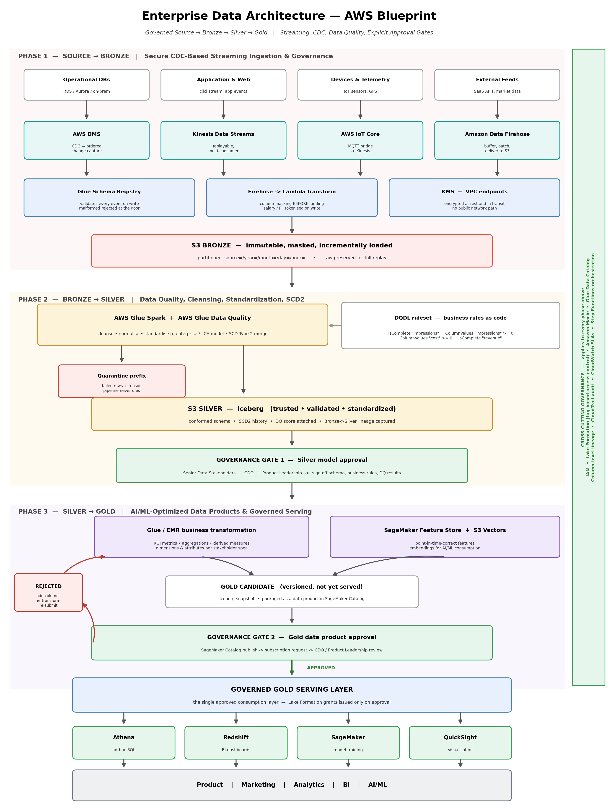

# LCA Governed Source-to-Gold Streaming & AI Data Platform

**Owner:** Paresh Ranjan Rout
**Build start date:** 9 August 2026
**Status:** Phase 1 in progress
**Cloud:** AWS (native)

---

## Architecture Vision

Design and implement a secure, governed, scalable, streaming-enabled enterprise data architecture that transforms source-system data into trusted, standardized, business-ready, and AI/ML-optimized Gold data products through controlled **Source → Bronze → Silver → Gold** layers.

> *"Ingest once, govern continuously, standardize progressively, approve explicitly, and serve trusted data from the Gold layer."*



---

## What makes this architecture different — 5 key points

**1. Governance gates sit *between* layers, not at the end.**
Most medallion architectures show data flowing Bronze → Silver → Gold as a pure pipeline. This one inserts formal approval checkpoints. Data does not promote because a job succeeded — it promotes because Senior Data Stakeholders, the CDO, and Product Leadership signed off on the schema, the business rules, and the data quality results.

**2. The rejection loop is a first-class part of the architecture.**
Most designs only draw the happy path. Here, *rejected → add columns → re-transform → re-validate → re-submit* is an explicit cycle in the diagram. It reflects how data products are actually delivered: negotiated with stakeholders over several rounds, not handed over once.

**3. Column masking happens on write, not on read.**
Salary and PII are tokenised in the Firehose Lambda transform **before** the record lands in Bronze. The raw sensitive value never physically exists on disk. The common alternative — store raw, mask at query time — is simpler to build but leaves the value recoverable. Trade-off accepted: masked values cannot be reversed, so anything requiring recovery is tokenised rather than masked.

**4. Business rules are executable code, not prose in a document.**
Stakeholder rules are expressed in AWS Glue Data Quality's DQDL, making them version-controlled, independently auditable, and automatically scored:

```
Rules = [
    IsComplete "impressions",
    ColumnValues "impressions" >= 0,
    ColumnValues "cost" >= 0,
    IsComplete "revenue"
]
```

That score becomes evidence in the approval pack rather than an assertion someone makes in a meeting.

**5. Bronze is immutable, and nothing is ever consumed from it.**
Every consumer reads Silver or Gold. Bronze exists solely as the replay layer. If a transformation defect is found months later, Silver and Gold are rebuilt from Bronze rather than being permanently wrong. Bad records are quarantined with a reason instead of failing the job — and the **quarantine rate** becomes a monitored signal that a producer changed something without telling anyone.

---

## The three phases

| Phase | Transition | Focus |
|---|---|---|
| **Phase 1** | Source → Bronze | Secure CDC-based streaming ingestion, schema validation, column masking, governed raw preservation |
| **Phase 2** | Bronze → Silver | Data quality validation, cleansing, standardization to the enterprise canonical model, SCD Type 2 — then **Governance Gate 1** |
| **Phase 3** | Silver → Gold | Business transformation, ROI modelling, AI/ML feature and embedding preparation — then **Governance Gate 2** and governed serving |

---

## Repository structure

```
├── docs/                        Architecture blueprint, service mapping, decision records
│   └── decisions/               ADRs — why each significant choice was made
├── phase-1-source-to-bronze/    Ingestion build
│   ├── infrastructure/          IAM roles, policies, bucket configuration
│   ├── scripts/                 Ingestion and transform code
│   └── screenshots/             Console evidence
├── phase-2-bronze-to-silver/    Quality and standardization build
│   ├── data-quality/            DQDL rulesets
│   ├── scripts/
│   └── screenshots/
├── phase-3-silver-to-gold/      Data product build
│   ├── scripts/
│   └── screenshots/
├── governance/                  Cross-cutting controls
│   ├── approval-gates/          Gate templates and approval records
│   └── data-contracts/          Producer ↔ platform contracts
├── tracking/                    The build story
│   ├── PROGRESS.md              Dated build log
│   ├── ERRORS.md                Troubleshooting log with root causes
│   └── DECISIONS.md             Running decision log
└── assets/diagrams/             Source files for diagrams
```

---

## AWS services used

| Layer | Services |
|---|---|
| Ingestion | AWS DMS (CDC), Kinesis Data Streams, AWS IoT Core, Amazon Data Firehose |
| Schema & masking | Glue Schema Registry, Lambda transform, KMS, VPC endpoints |
| Storage | Amazon S3 (Bronze / Silver / Gold), Apache Iceberg, S3 Vector buckets |
| Processing | AWS Glue Spark, AWS Glue Data Quality, Amazon EMR |
| AI/ML | SageMaker Feature Store, SageMaker |
| Serving | Athena, Redshift, QuickSight |
| Governance | IAM, Lake Formation (tag-based access control), Amazon Macie, Glue Data Catalog, SageMaker Catalog, CloudTrail, CloudWatch, Step Functions |

---

## Documentation

- [AWS Blueprint — full service mapping and design decisions](docs/aws-blueprint.md)
- [Build progress log](tracking/PROGRESS.md)
- [Troubleshooting log](tracking/ERRORS.md)
- [Decision log](tracking/DECISIONS.md)
