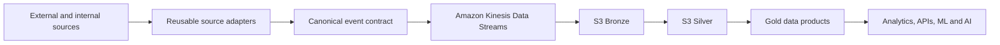
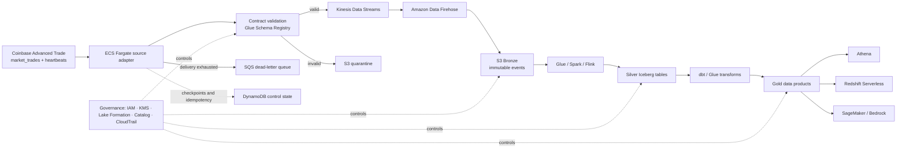

# LCA Governed Source-to-Gold Streaming & AI Data Platform

**Project status:** 🟠 IN PROGRESS — Phase 1 Source to Stream

**Owner and Lead Architect:** Paresh Ranjan Rout

**Portfolio:** Data Architecture & Engineering 2026

**Current delivery stage:** Architecture baseline and Phase 1 — Source to Stream

## Mission

Build a reusable AWS data backbone that onboards heterogeneous real-time sources, converts them into governed event contracts, delivers them reliably through a streaming platform, and produces trusted data for analytics and AI.

The Phase 1 source is locked to the **Coinbase Advanced Trade public WebSocket**. The adapter consumes `market_trades` and `heartbeats` for `BTC-USD` and `ETH-USD`. Coinbase is the proving source for a platform that can later support customer events, application telemetry, IoT feeds, transactions, and partner APIs.

## Locked Phase 1 source

| Property | Decision |
|---|---|
| Provider | Coinbase Advanced Trade |
| Endpoint | `wss://advanced-trade-ws.coinbase.com` |
| Business channel | `market_trades` |
| Operational channel | `heartbeats` |
| Initial products | `BTC-USD`, `ETH-USD` |
| Kinesis ordering domain | `event_source + product_id` |
| Canonical event identity | `coinbase.market_trade.{product_id}.{trade_id}` |
| Authentication | Public channels; no credential required for the initial scope |
| Source replay | Best-effort REST recovery plus Kinesis retention; no unsupported replay guarantee |

Detailed source behavior and mapping are defined in [`phase-1-source-to-stream/coinbase-source-specification.md`](phase-1-source-to-stream/coinbase-source-specification.md). The decision is recorded in [`ADR-004`](docs/decisions/ADR-004-coinbase-phase-1-source.md).

## Problem statement

Companies often integrate every new source with a separate pipeline. The result is duplicated engineering, inconsistent schemas, fragile retry logic, weak lineage, delayed analytics, and uncontrolled data entering AI systems.

This architecture establishes a repeatable source-to-consumption framework:

## Target architecture

## Architecture visuals

| View | Diagram |
|---|---|
| Three-phase delivery model | [Open PNG](architecture/three-phase-delivery-model.png) |
| Phase 1 source-to-stream flow | [Open PNG](architecture/phase-1-source-to-stream.png) |
| Governance control plane | [Open PNG](architecture/governance-control-plane.png) |
| Automated delivery flow | [Open PNG](architecture/automated-delivery-flow.png) |

## Three delivery phases

| Phase | Status | Outcome | Primary technologies | Exit evidence |
|---|---|---|---|---|
| 1. Source to Stream | **🟠 IN PROGRESS** | Reliable, governed Coinbase trade ingestion | Coinbase Advanced Trade, ECS Fargate, Glue Schema Registry, Kinesis, SQS DLQ, DynamoDB control state, CloudWatch, Terraform | Reconnect, heartbeat, retry, gap reporting, schema compatibility, zero unexplained loss in controlled tests |
| 2. Bronze to Silver | ⚪ PLANNED | Immutable raw history and trustworthy datasets | Amazon Data Firehose, S3, Glue, Spark/Flink, Apache Iceberg, Glue Data Quality | Count reconciliation, deterministic deduplication, late-data handling, reproducible reprocessing |
| 3. Silver to Gold | ⚪ PLANNED | Governed business value and safe AI consumption | dbt/Glue, Athena, Redshift Serverless, QuickSight, SageMaker, Bedrock, Lake Formation | Approved metrics, lineage, role-based access, query SLOs, evaluated AI outputs |

## Architecture principles

1. Start with the business failure, not the AWS service.
2. Prefer managed services until control or portability requirements justify operational complexity.
3. Design for at-least-once delivery and idempotent processing; do not claim end-to-end exactly-once.
4. Preserve immutable raw history before applying business transformations.
5. Treat schemas, ownership, classification, quality, lineage, and retention as part of the data product.
6. Apply governance, observability, security, and cost controls from Phase 1.
7. Promote only when measurable architecture gates pass.
8. Record every material decision and its revisit trigger in an ADR.

## Repository map

| Path | Purpose |
|---|---|
| [`docs/01-problem-statement.md`](docs/01-problem-statement.md) | Business context, stakeholders, scope, and measurable outcomes |
| [`docs/02-target-architecture.md`](docs/02-target-architecture.md) | Logical architecture, flows, boundaries, and failure behavior |
| [`docs/03-technology-decisions.md`](docs/03-technology-decisions.md) | AWS service selection, alternatives, pros, cons, and triggers |
| [`docs/04-non-functional-requirements.md`](docs/04-non-functional-requirements.md) | Proposed reliability, performance, security, recovery, and cost SLOs |
| [`docs/05-delivery-roadmap.md`](docs/05-delivery-roadmap.md) | Three phases, work increments, gates, and evidence |
| [`governance/`](governance/) | Governance operating model, control matrix, and approval gates |
| [`contracts/`](contracts/) | Canonical JSON Schema, sample event, and contract metadata |
| [`automation/`](automation/) | CI/CD, infrastructure, schema, security, and data-quality automation |
| [`architecture/`](architecture/) | Presentation-ready architecture, governance, and automation diagrams |
| [`phase-1-source-to-stream/`](phase-1-source-to-stream/) | **IN PROGRESS** — active Coinbase source-to-stream implementation |
| [`docs/presentation/`](docs/presentation/) | Executive and technical architecture deck |

## Current boundary

**🟠 Status: IN PROGRESS**

**🔒 Source locked:** Coinbase Advanced Trade public WebSocket using `market_trades` and `heartbeats` for `BTC-USD` and `ETH-USD`.

Phase 1 is the active build. Source selection, architecture, governance baseline, canonical mapping, and the initial contract are complete and repository-validated. Live Coinbase connectivity, adapter runtime, AWS infrastructure, deployment, and operational evidence have not yet passed their tests. Phases 2 and 3 remain target-state roadmaps until the Phase 1 gate passes.

## Phase 1 execution tracker

### Status legend

- ✅ **ACHIEVED & VERIFIED** — deliverable exists and its listed repository check passed.
- 🟠 **NEXT / IN PROGRESS** — current implementation focus; acceptance test has not passed yet.
- ⬜ **NOT STARTED** — no completion claim and no test evidence yet.

| Step | Deliverable | Status | Test or evidence |
|---:|---|---|---|
| 1 | Problem statement, scope and proposed outcomes | ✅ ACHIEVED & VERIFIED | Architecture documents and internal links validated |
| 2 | Coinbase source decision | ✅ ACHIEVED & VERIFIED — **LOCKED** | ADR-004 accepted; endpoint, channels and products documented from official sources |
| 3 | Target architecture, governance controls and AWS service decisions | ✅ ACHIEVED & VERIFIED | ADR set, control matrix, diagrams and presentation structural checks passed |
| 4 | Canonical event and Coinbase data contract | ✅ ACHIEVED & VERIFIED — design baseline | JSON/YAML parse checks and deterministic sample identity/partition mapping passed; live fixture validation remains Step 5 |
| 5 | Local Coinbase connectivity spike and captured fixtures | 🟠 **NEXT STEP** | Must prove subscribe, heartbeat, multi-trade parsing, reconnect and safe fixture capture |
| 6 | Containerized local source adapter | ⬜ NOT STARTED | Unit, contract and container smoke tests required |
| 7 | Kinesis producer and reconciliation consumer | ⬜ NOT STARTED | Local/AWS integration, partial-failure, duplicate and replay tests required |
| 8 | Terraform AWS foundation | ⬜ NOT STARTED | Format, validate, security scan, plan and clean-environment deployment required |
| 9 | ECS deployment, contracts, quarantine, DLQ and control state | ⬜ NOT STARTED | End-to-end source-to-Kinesis reconciliation and redrive tests required |
| 10 | Observability, security, recovery and cost evidence | ⬜ NOT STARTED | Alarms, failure injection, runbooks, access tests and unit-cost report required |
| 11 | Phase 1 Gate approval | ⬜ NOT STARTED | Every mandatory Gate 1 control must link to passing evidence |

### Immediate next steps

1. Create the local adapter and test directory structure.
2. Connect to Coinbase and subscribe to both locked channels.
3. Capture sanitized fixtures for heartbeat, single-trade and multi-trade messages.
4. Implement canonical mapping without floating-point conversion of `price` or `size`.
5. Add reconnect, stale-heartbeat, duplicate, malformed-message and sequence-discontinuity tests.
6. Containerize and pass the local smoke test before creating AWS resources.

The detailed implementation order and definition of done are maintained in [`phase-1-source-to-stream/README.md`](phase-1-source-to-stream/README.md).

## Definition of portfolio quality

This project earns credibility through evidence rather than diagrams alone: reproducible infrastructure, failure-injection results, reconciliation reports, ADRs, cost estimates, security controls, runbooks, dashboards, and a traceable path from source event to business metric.
