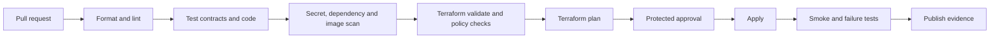

# Delivery and Data-Flow Automation

## Infrastructure delivery flow

## Required CI controls

- Markdown and link checks for architecture documentation;
- JSON Schema validation and backward-compatibility tests;
- Python linting, type checks, unit tests, and dependency scanning;
- Terraform format, validate, lint, policy, and security checks;
- container build with software bill of materials and vulnerability scan;
- secret scanning before merge and before image publication;
- immutable image tags tied to Git commit SHA;
- manual approval for protected environments;
- post-deploy smoke, rollback, and evidence collection.

## Environment strategy

| Environment | Purpose | Data policy | Deployment |
|---|---|---|---|
| Local | Contract and adapter development | Synthetic/public samples only | Developer tooling |
| Development | Integration and failure testing | Public/synthetic data | Automated apply |
| Staging | Production-like performance and governance | Approved representative data | Protected approval |
| Production | Business service | Governed source data | Separation of duties and change record |

The learning implementation may begin in one sandbox account, but resource names, state, roles, contracts, and pipelines must remain environment-aware.

## Runtime automation

- ECS maintains desired task count and replaces unhealthy tasks.
- Adapter backoff includes jitter and a maximum delay.
- Kinesis on-demand capacity is monitored before any switch to provisioned mode.
- SQS DLQ depth and age trigger investigation; redrive is controlled and auditable.
- Quarantine objects are classified, lifecycle-managed, and replayed only through an approved tool.
- Schema changes use compatibility checks before producer deployment.
- Phase 2 jobs reconcile counts and publish data-quality evidence.

## Promotion rule

No resource or data product is promoted because a demo succeeded once. Promotion requires repeatable automation, failure evidence, security review, cost visibility, ownership, and a rollback/redrive path.
