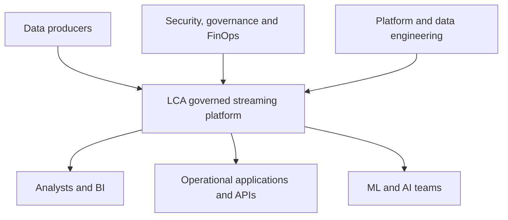
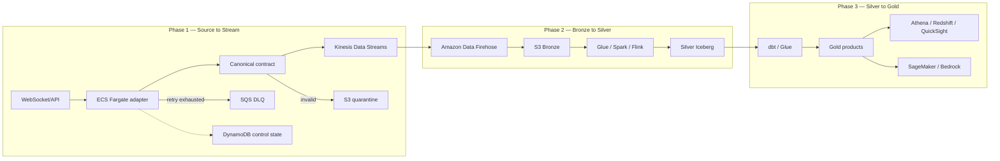

# Target Architecture and Data Flow

## Architectural intent

Separate the platform into a **data plane**, which transports and transforms events, and a **control plane**, which manages contracts, configuration, identity, deployments, evidence, and policy.

## System context

## End-to-end logical flow

## Phase 1 detailed behavior

1. An ECS Fargate service maintains the long-running external connection.
2. The adapter parses the source event without discarding the original payload.
3. It creates a stable `event_id`, timestamps receipt, assigns a partition key, and wraps the payload in the canonical envelope.
4. AWS Glue Schema Registry enforces the registered contract and compatibility policy.
5. Valid events are batch-written to Kinesis using bounded retries, exponential backoff, and partial-failure handling.
6. Invalid events are encrypted and quarantined in S3 with a non-sensitive rejection reason.
7. Events that exhaust delivery retries go to an SQS DLQ for investigation and redrive.
8. DynamoDB stores checkpoints, source state, and idempotency records where required.
9. CloudWatch exposes connection state, accepted/rejected records, delivery failures, throttling, age, lag, and cost-related utilization.

## Ordering and identity

- Ordering is required only within a defined entity such as `source + instrument`; global ordering is not promised.
- The Kinesis partition key uses that ordering domain and is monitored for hot partitions.
- `event_id` is deterministic when the source provides stable identity; otherwise it is derived from selected immutable fields.
- All consumers are idempotent because producer retries and downstream delivery can create duplicates.
- `source_event_time`, `ingestion_time`, and `processing_time` remain separate.

## Failure paths

| Failure | Expected response | Evidence |
|---|---|---|
| Source disconnect | Backoff, reconnect, resume from source capability/checkpoint | Reconnection test and gap report |
| Invalid schema | Quarantine; never silently discard | Quarantine object and metric |
| Partial `PutRecords` failure | Retry only failed records | Structured log and retry metric |
| Kinesis throttling | Backoff, scale review, alarm | Throttle alarm and runbook execution |
| Retry exhaustion | SQS DLQ with safe diagnostic metadata | DLQ alarm and redrive test |
| Adapter crash | ECS service replaces unhealthy task | Recovery-time measurement |
| Duplicate event | Idempotent Silver processing | Deduplication reconciliation |
| Secret exposure attempt | CI secret scan blocks merge/deploy | Pipeline evidence |

## Data zones

| Zone | Purpose | Mutation policy | Typical access |
|---|---|---|---|
| Quarantine | Invalid or policy-rejected records | Append-only; controlled remediation | Data steward and platform role |
| Bronze | Immutable source truth | Append-only; lifecycle-managed | Restricted engineering role |
| Silver | Validated, standardized, deduplicated | Rebuildable from Bronze | Data engineers and approved analysts |
| Gold | Approved business metrics and features | Versioned data product | BI, applications, ML/AI consumers |

## Trust boundaries

- The public internet terminates at the source adapter's outbound connection; no public inbound listener is required for ingestion.
- Credentials come from Secrets Manager and task roles, never images or repository files.
- Private subnets use controlled egress and VPC endpoints where justified by cost and threat model.
- Separate roles exist for deployment, task execution, runtime producer, quarantine writer, observer, and break-glass operations.
- Encryption uses customer-managed KMS keys where control, audit, or separation requirements justify them.

## Target evolution

The Phase 1 single-account learning environment must preserve interfaces that can later move into separate development, staging, production, security, and data-governance accounts without redesigning event contracts.
