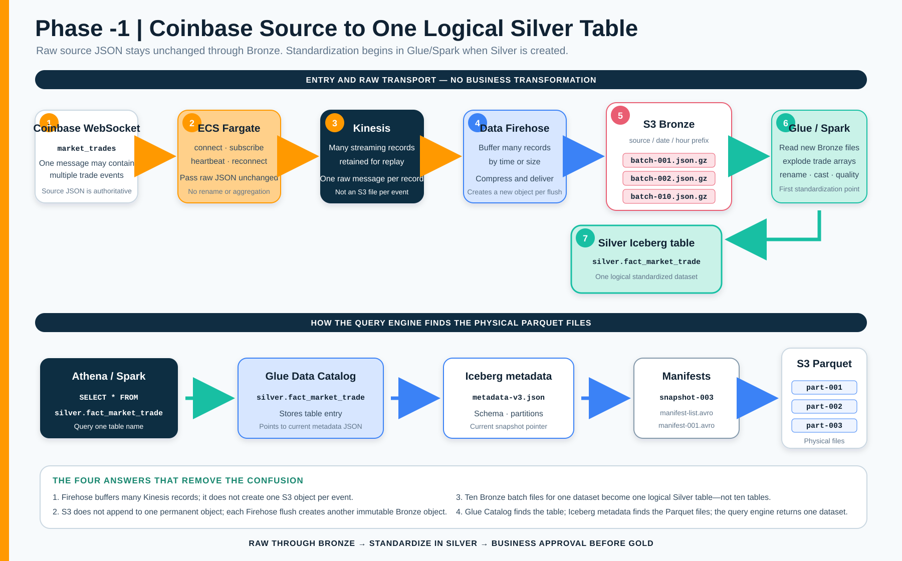

# Phase -1 — Source-to-Silver Backend Explainer

**Owner:** Paresh Ranjan Rout

## One-page architecture



This diagram is the end-to-end learning and deployment view. The main README execution tracker remains the authority for which steps are built and verified.

## Final agreed processing rule

```text
Coinbase source JSON
    → transport unchanged through ECS and Kinesis
    → batch unchanged into S3 Bronze JSON.GZIP objects
    → standardize, validate and transform in Glue/Spark
    → commit to one logical Silver Iceberg table
    → obtain business approval before building Gold
```

Bronze is the immutable source copy. It preserves Coinbase field names, values and nested message structure. The first business transformation occurs while Glue/Spark creates Silver.

## Service-by-service responsibility

| Step | Service | Exact responsibility | It does not do |
|---:|---|---|---|
| 1 | Coinbase WebSocket | Sends live `market_trades` JSON messages | Create S3 files or Silver tables |
| 2 | ECS Fargate adapter | Connect, subscribe, monitor heartbeat, reconnect and pass raw messages | Rename columns, aggregate trades or create business facts |
| 3 | Kinesis Data Streams | Accept and retain many streaming records for consumers/replay | Combine records into S3 objects |
| 4 | Data Firehose | Read Kinesis, buffer records by time/size, compress and deliver batches | Append forever to one S3 object |
| 5 | S3 Bronze | Store many immutable JSON.GZIP batch objects under one dataset prefix | Present dimension/fact tables |
| 6 | Glue/Spark | Incrementally read new Bronze objects, explode trades, cast, rename, deduplicate and run quality rules | Change the Bronze source history |
| 7 | Apache Iceberg Silver | Commit standardized rows and manage table snapshots/files | Store everything in one appendable Parquet file |
| 8 | Glue Data Catalog | Store `silver.fact_market_trade` and its current Iceberg metadata location | Store all trade rows directly |
| 9 | Athena/Spark | Resolve the Catalog entry and Iceberg metadata, then read required Parquet files | Manually discover every S3 file |

## Questions resolved during architecture review

### Does every Kinesis event create one S3 object?

No. Firehose buffers many Kinesis records and writes them together. Object count is controlled by delivery buffering, data rate, compression and partitioning.

### Can S3 maintain one file and append every new event?

No. S3 data-lake objects are immutable delivery units. Each Firehose flush creates a new object. The Bronze prefix is the dataset; an individual object is only one batch within it.

### If one Bronze dataset has ten batch files, does Silver create ten tables?

No. Glue/Spark reads the ten objects for that dataset and appends their standardized rows to one logical table, such as `silver.fact_market_trade`.

### If four Bronze datasets contain forty files, how many Silver tables are created?

The mapping is controlled by dataset contracts, not file count:

```text
10 market-trade batches → silver.fact_market_trade
10 instrument batches   → silver.dim_instrument
10 ticker batches       → silver.fact_ticker
10 candle batches       → silver.fact_candle
```

The result is four logical Silver tables.

### Why can one Iceberg table contain several Parquet files?

Parquet files are physical S3 objects and are not continuously appendable. Iceberg manages those files through snapshots and manifests. Users query the one logical table name rather than the individual files.

### How does the query engine know which files belong to the table?

```text
Athena/Spark
    → Glue Catalog entry: silver.fact_market_trade
    → current Iceberg metadata JSON
    → snapshot and manifest files
    → required Parquet files
```

### If Glue Catalog already has an S3 prefix, what does the manifest list do?

This was the exact doubt raised during the review:

> Glue Catalog has a direct S3 prefix link. The query engine can identify the table entry and follow that location, so why is a manifest list required?

The answer depends on the table type.

| Without Iceberg manifests: ordinary external Parquet table | With Iceberg manifests: Iceberg table |
|---|---|
| Glue Catalog points to an S3 prefix. | Glue Catalog identifies the Iceberg table and its current metadata location. |
| The query engine discovers files from the prefix and Catalog partition information. | Iceberg metadata identifies the current table snapshot. |
| The prefix tells where objects exist, but not which objects form the current valid table version. | The snapshot points to a manifest list containing the manifests for that version. |
| Old, replaced, deleted, orphaned or failed-write files cannot be classified from their S3 location alone. | Manifests record the exact active Parquet files and useful file/column statistics. |
| There is no Iceberg snapshot isolation or time-travel state. | Atomic snapshots, time travel, rollback and file pruning are possible. |

An Iceberg query therefore follows this chain:

```text
Athena/Spark
    → Glue Catalog table entry
    → current Iceberg metadata JSON
    → current snapshot
    → manifest list for that snapshot
    → manifest files
    → exact active Parquet files
    → table rows
```

For example, the S3 table directory may physically contain five files:

```text
part-001.parquet  current
part-002.parquet  current
part-003.parquet  replaced by compaction
part-004.parquet  current
part-005.parquet  left by an incomplete write
```

The S3 prefix reveals that all five objects exist. The current Iceberg manifests can declare that only `part-001`, `part-002` and `part-004` belong to the current snapshot. Athena/Spark reads those three and does not treat the other two as current table data.

> **S3 prefix says where files are stored. Iceberg manifests say which files are officially part of the table right now.**

`snapshot-003` in the architecture diagram represents a snapshot ID/version; it is not intended to mean that a physical file must literally be named `snapshot-003`.

### Why not use CSV to obtain one file?

CSV objects in S3 also do not solve continuous append. CSV additionally loses strong typing, column pruning and efficient compression. Silver therefore uses Iceberg with Parquet; a single CSV can be generated later only as an export.

## Deployment sequence and proof

| Order | Build | Required proof before continuing |
|---:|---|---|
| 1 | Connect locally to Coinbase | Heartbeat and trade messages captured safely |
| 2 | Send unchanged source messages to a local/test sink | Byte/payload comparison proves no business transformation |
| 3 | Publish raw messages to Kinesis | Received and acknowledged counts reconcile |
| 4 | Deliver Kinesis records through Firehose | Multiple input records appear in batched JSON.GZIP Bronze objects |
| 5 | Run incremental Glue/Spark processing | Only new Bronze objects are processed; trade arrays become rows |
| 6 | Create `silver.fact_market_trade` as Iceberg | Glue Catalog entry, metadata JSON, snapshot, manifests and Parquet files exist |
| 7 | Query through Athena | Table count and values reconcile to the processed Bronze window |
| 8 | Run compaction when file metrics justify it | Fewer/larger data files with unchanged row-level result |
| 9 | Run Silver quality and business review | Approved names, types, null rules, deduplication and definitions |
| 10 | Begin Gold only after approval | Approval record links to the accepted Silver contract |

## Silver approval loop

```text
Create standardized Silver table
    → run technical quality checks
    → business reviews columns and definitions
        → rejected: modify Silver rules, rebuild and resubmit
        → approved: version the contract and begin Gold
```

SCD Type 2 is applied only to dimensions that require attribute-history tracking. Trade facts remain append-oriented and are not automatically modeled as SCD Type 2.
