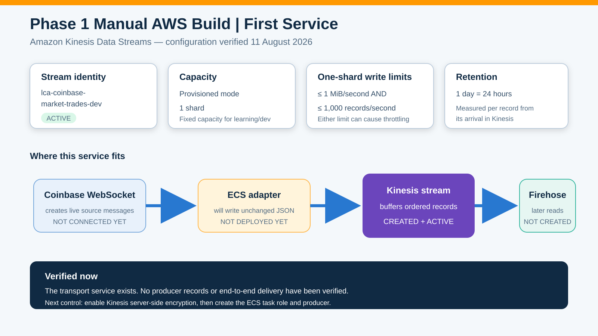
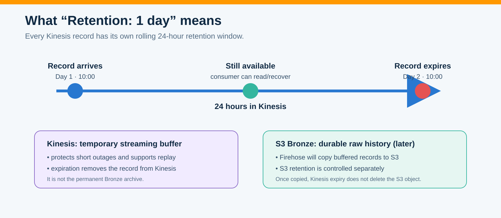
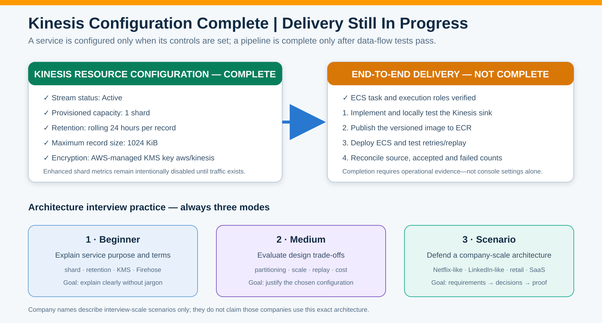

# Phase 1 Manual AWS Implementation

**Status:** 🟠 IN PROGRESS

**Owner:** Paresh Ranjan Rout

**Region:** `us-east-1`

**Configuration method:** AWS Management Console, completed manually for architecture learning

## Why Kinesis is the first AWS service

Coinbase creates live market messages. A future ECS adapter will maintain the WebSocket connection and write each unchanged Coinbase `market_trades` message to Kinesis. Kinesis is the short-lived streaming transport: it accepts, orders and temporarily retains records for downstream consumers. It does **not** connect to Coinbase or generate events by itself.



## Steps 1–2 — Kinesis resource configuration completed

| Setting | Manual selection | Meaning |
|---|---|---|
| Stream name | `lca-coinbase-market-trades-dev` | Development market-trade transport |
| Region | `us-east-1` | All Phase 1 resources remain colocated initially |
| Capacity mode | Provisioned | Capacity is explicitly controlled |
| Provisioned shards | 1 | Small learning/development starting capacity |
| Write capacity | up to 1 MiB/second **and** 1,000 records/second | Both limits must remain within capacity |
| Shared read capacity | up to 2 MiB/second | Shared among standard consumers |
| Retention | 1 day | Each record remains available for 24 hours after arrival |
| Maximum record size | 1024 KiB | More than sufficient for expected Coinbase messages |
| Server-side encryption | Enabled with AWS-managed `aws/kinesis` | Kinesis encrypts future records at rest using AWS KMS |
| Enhanced shard metrics | Disabled for now | Basic monitoring is sufficient until producer traffic exists |
| Status observed | Active | The AWS stream resource exists and can accept permitted writes |

### One-shard theory

The two write limits are independent gates, not alternatives:

```text
incoming bytes  ≤ 1 MiB/second
AND
incoming count  ≤ 1,000 records/second
```

For example, 1,100 tiny records in one second can throttle because the record-count limit is exceeded. A small number of large records totaling more than 1 MiB in one second can also throttle because the byte limit is exceeded.

Kinesis does not write to Firehose. The direction is the reverse: Firehose will later be configured as a consumer that reads records from this Kinesis stream, buffers many records by size/time and writes compressed Bronze objects to S3.

## What one-day retention means



Retention is rolling per record. A record arriving at 10:00 on Day 1 is normally readable until 10:00 on Day 2. It then expires from Kinesis. When Firehose is added, a copy already written to S3 Bronze is governed by the S3 lifecycle policy and is not deleted merely because the Kinesis record expires.

## Verified evidence and current boundary

Evidence: [`manual-kinesis-stream-creation.json`](../phase-1-source-to-stream/evidence/manual-kinesis-stream-creation.json)

- ✅ The named Kinesis stream was observed as `ACTIVE` in `us-east-1`.
- ✅ Provisioned mode, one shard, 24-hour retention and 1024-KiB record maximum were observed.
- ✅ Server-side encryption was successfully updated using the AWS-managed KMS key `aws/kinesis`.
- ✅ Kinesis **resource configuration** is complete for the current development scope.
- ⬜ No Coinbase producer has written to the stream yet.
- ⬜ No Firehose, S3 Bronze delivery or end-to-end reconciliation has been tested.

This does **not** mean the Kinesis data-delivery implementation is complete. Completion of delivery requires the ECS producer, successful writes, retry/throttle/replay tests and source-to-Kinesis count reconciliation.

The supplied console screenshots contained the AWS account identifier and full resource ARN. They are intentionally not published. The architecture SVGs and redacted JSON retain the useful configuration evidence without exposing account identifiers.

## Manual implementation tracker

| Step | Deliverable | Status | Required test or evidence |
|---:|---|---|---|
| 1 | Create Kinesis data stream | ✅ ACHIEVED & VERIFIED | Stream observed `ACTIVE`; redacted configuration evidence committed |
| 2 | Enable Kinesis server-side encryption | ✅ ACHIEVED & VERIFIED | Success confirmation observed; AWS-managed `aws/kinesis` selected |
| 3 | Create least-privilege ECS task and execution roles | 🟠 NEXT | IAM trust policies and policy simulator/access test |
| 4 | Create ECS runtime for the Coinbase adapter | ⬜ NOT STARTED | Healthy task and CloudWatch logs |
| 5 | Prove Coinbase → ECS → Kinesis delivery | ⬜ NOT STARTED | Record counts, timestamps and unchanged JSON sample evidence |
| 6 | Create Firehose and S3 Bronze delivery | ⬜ NOT STARTED | Buffered `JSON.GZIP` objects plus count reconciliation |

## Governance note

The first stream was created during a root-console learning session. Root MFA is enabled, but routine root use remains a temporary governance exception. The deployed application will use an ECS task role with least-privilege access; no AWS keys will be stored in application code or GitHub.

## Architecture interview preparation

The completed Kinesis and KMS controls are converted into Beginner, Medium and Company-scale Scenario interview practice in [`08-kinesis-kms-architecture-interview-guide.md`](08-kinesis-kms-architecture-interview-guide.md).



## AWS references

- [Create and manage Kinesis data streams](https://docs.aws.amazon.com/streams/latest/dev/working-with-streams.html)
- [Kinesis Data Streams quotas and limits](https://docs.aws.amazon.com/streams/latest/dev/service-sizes-and-limits.html)
- [Kinesis consumer startup, retention and iterator-age guidance](https://docs.aws.amazon.com/streams/latest/dev/kinesis-record-processor-additional-considerations.html)
