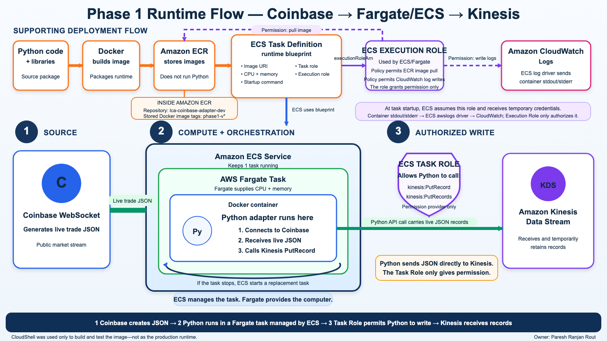
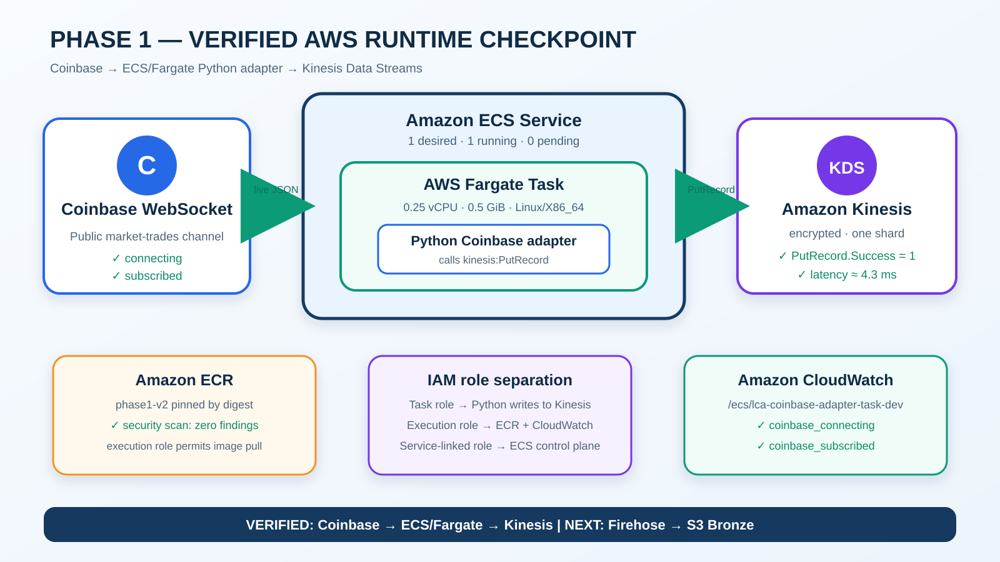

# Phase 1 Manual AWS Implementation

**Status:** 🟠 IN PROGRESS

**Owner:** Paresh Ranjan Rout

**Region:** `us-east-1`

**Configuration method:** AWS Management Console, completed manually for architecture learning

## Why Kinesis is the first AWS service

Coinbase creates live market messages. A future ECS adapter will maintain the WebSocket connection and write each unchanged Coinbase `market_trades` message to Kinesis. Kinesis is the short-lived streaming transport: it accepts, orders and temporarily retains records for downstream consumers. It does **not** connect to Coinbase or generate events by itself.


## Steps 1–2 — Kinesis resource configuration completed

| Setting | Manual selection | Meaning |
|---|---|---|
| Stream name | `lca-coinbase-market-trades-dev` | Development market-trade transport |
| Region | `us-east-1` | All Phase 1 resources remain colocated initially |
| Capacity mode | Provisioned | Capacity is explicitly controlled |
| Provisioned shards | 1 | Small learning/development starting capacity |
| Write capacity | up to 1 MiB/second **and** 1,000 records/second | Both limits must remain within capacity |
| Shared read capacity | up to 2 MiB/second | Shared among standard consumers |
| Retention | 1 day | Each record remains available for 24 hours after arrival |
| Maximum record size | 1024 KiB | More than sufficient for expected Coinbase messages |
| Server-side encryption | Enabled with AWS-managed `aws/kinesis` | Kinesis encrypts future records at rest using AWS KMS |
| Enhanced shard metrics | Disabled for now | Basic monitoring is sufficient until producer traffic exists |
| Status observed | Active | The AWS stream resource exists and can accept permitted writes |

### One-shard theory

The two write limits are independent gates, not alternatives:

```text
incoming bytes  ≤ 1 MiB/second
AND
incoming count  ≤ 1,000 records/second
```

For example, 1,100 tiny records in one second can throttle because the record-count limit is exceeded. A small number of large records totaling more than 1 MiB in one second can also throttle because the byte limit is exceeded.

Kinesis does not write to Firehose. The direction is the reverse: Firehose will later be configured as a consumer that reads records from this Kinesis stream, buffers many records by size/time and writes compressed Bronze objects to S3.

## What one-day retention means


Retention is rolling per record. A record arriving at 10:00 on Day 1 is normally readable until 10:00 on Day 2. It then expires from Kinesis. When Firehose is added, a copy already written to S3 Bronze is governed by the S3 lifecycle policy and is not deleted merely because the Kinesis record expires.

## Verified evidence and current boundary

Evidence: [`manual-kinesis-stream-creation.json`](../phase-1-source-to-stream/evidence/manual-kinesis-stream-creation.json)

- ✅ The named Kinesis stream was observed as `ACTIVE` in `us-east-1`.
- ✅ Provisioned mode, one shard, 24-hour retention and 1024-KiB record maximum were observed.
- ✅ Server-side encryption was successfully updated using the AWS-managed KMS key `aws/kinesis`.
- ✅ Kinesis **resource configuration** is complete for the current development scope.
- ✅ Paresh manually submitted one test record through AWS CloudShell; `PutRecord` returned a shard ID, sequence number and `KMS` encryption type.
- ✅ Data Viewer returned that record from `Trim horizon` with the expected `manual-test` partition key and test payload.
- ⬜ No Coinbase application producer has written to the stream yet.
- ⬜ No Firehose, S3 Bronze delivery or end-to-end reconciliation has been tested.

Manual write/read evidence: [`manual-kinesis-write-read-smoke-test.json`](../phase-1-source-to-stream/evidence/manual-kinesis-write-read-smoke-test.json)

This does **not** mean the Kinesis data-delivery implementation is complete. Completion of delivery requires the ECS producer, successful writes, retry/throttle/replay tests and source-to-Kinesis count reconciliation.

The supplied console screenshots contained the AWS account identifier and full resource ARN. They are intentionally not published. The architecture SVGs and redacted JSON retain the useful configuration evidence without exposing account identifiers.

## Step 3 — Initial ECS IAM foundation completed

Two different identities are required because the application and the ECS/Fargate platform are different callers:

```text
Coinbase Python application
    → task role: lca-coinbase-ecs-task-role-dev
    → PutRecord and PutRecords
    → exact development Kinesis stream only

ECS/Fargate platform
    → execution role: lca-coinbase-ecs-execution-role-dev
    → AmazonECSTaskExecutionRolePolicy
    → ECR image pull and CloudWatch log delivery
```

Both roles trust `ecs-tasks.amazonaws.com` through `sts:AssumeRole`. Their policies differ because trust answers **who may use the role**, while permissions answer **what the role may do and where**.

Task-role policy simulation produced both required outcomes:

| Test | Expected | Observed |
|---|---|---|
| `PutRecord` on exact stream ARN | Allow | ✅ Allowed |
| `PutRecords` on exact stream ARN | Allow | ✅ Allowed |
| `PutRecord` on wildcard resource | Deny | ✅ Implicit deny |
| `PutRecords` on wildcard resource | Deny | ✅ Implicit deny |

Evidence: [`manual-ecs-iam-foundation.json`](../phase-1-source-to-stream/evidence/manual-ecs-iam-foundation.json)

The initial IAM **configuration and static authorization tests** are complete. Runtime role assumption, ECR pull, CloudWatch logging and actual Kinesis writes remain unverified until the ECS task is deployed.

## Simple ECS/ECR/Fargate learning path

The complete beginner explanation—covering the Python bridge, Docker image, ECR storage, ECS manager, Fargate compute, task replacement, subnet placement, IAM roles, EC2 alternative and Glue/JDBC boundary—is maintained in [`10-ecs-ecr-fargate-simple-explainer.md`](10-ecs-ecr-fargate-simple-explainer.md).

The shortest version is:

```text
Python adapter = receives Coinbase messages and sends them to Kinesis
Docker image   = packaged Python application
ECR            = stores the application package
Fargate        = supplies managed compute where Python runs
ECS Service    = maintains the desired number of running tasks
```

## How Python runs before ECR and ECS exist

During development, Paresh's Mac is the temporary computer running Python:

```text
Mac Python process
    → KinesisRawMessageSink
    → recording test client (not AWS)
    → inspect the would-be PutRecord request
```

The recording client behaves like the small part of the AWS SDK used by the sink, but it stores the request in memory. This proves that the exact stream name, partition key and unchanged Coinbase UTF-8 bytes are supplied correctly without requiring AWS credentials or changing the real stream.

This test does **not** prove AWS network connectivity, ECS role assumption or live Kinesis delivery. Those checks can happen only after the packaged image is stored in ECR and run by ECS/Fargate.

Local evidence: [`local-kinesis-sink-test.json`](../phase-1-source-to-stream/evidence/local-kinesis-sink-test.json)

## Manual implementation tracker

| Step | Deliverable | Status | Required test or evidence |
|---:|---|---|---|
| 1 | Create Kinesis data stream | ✅ ACHIEVED & VERIFIED | Stream observed `ACTIVE`; redacted configuration evidence committed |
| 2 | Enable Kinesis server-side encryption | ✅ ACHIEVED & VERIFIED | Success confirmation observed; AWS-managed `aws/kinesis` selected |
| 2A | Manually write and read one Kinesis record | ✅ ACHIEVED & VERIFIED | CloudShell `PutRecord` succeeded with KMS; Data Viewer returned the expected test record |
| 3 | Create least-privilege ECS task and execution roles | ✅ ACHIEVED & VERIFIED | Trust policies verified; exact-stream allow and wildcard-deny simulations passed |
| 3A | Validate ECS, ECR, Fargate and IAM runtime responsibilities | ✅ ACHIEVED & VERIFIED — DESIGN | Final numbered blueprint and question-driven explanation completed |
| 4A | Implement and locally test `KinesisRawMessageSink` | ✅ ACHIEVED & VERIFIED — LOCAL | 4 focused tests and all 16 adapter tests passed; no AWS resource was changed |
| 4B | Create ECR repository and publish a secure versioned image | ✅ ACHIEVED & VERIFIED | `phase1-v2` built, live-tested and pushed; ECR basic scan completed successfully with no reported findings |
| 4C | Create ECS/Fargate runtime | 🟠 NEXT | Create the Task Definition, start a healthy task, verify runtime role assumption and inspect CloudWatch logs |
| 5 | Prove Coinbase → ECS → Kinesis delivery | ⬜ NOT STARTED | Record counts, timestamps and unchanged JSON sample evidence |
| 6 | Create Firehose and S3 Bronze delivery | ⬜ NOT STARTED | Buffered `JSON.GZIP` objects plus count reconciliation |

## Governance note

The first stream was created during a root-console learning session. Root MFA is enabled, but routine root use remains a temporary governance exception. The deployed application will use an ECS task role with least-privilege access; no AWS keys will be stored in application code or GitHub.

## Architecture interview preparation

The completed controls are converted into Beginner, Medium and Company-scale Scenario interview practice:

- [Kinesis and KMS architecture interview guide](08-kinesis-kms-architecture-interview-guide.md)
- [ECS IAM architecture interview guide](09-ecs-iam-architecture-interview-guide.md)
- [ECS, ECR and Fargate simple explainer](10-ecs-ecr-fargate-simple-explainer.md)
- [ECS, ECR and Fargate Data Engineer/Architect interview guide](11-ecs-ecr-fargate-data-engineering-architecture-interview-guide.md)


## Phase 1 architecture learning checkpoint — ACHIEVED & VERIFIED



Editable diagram: [`phase-1-runtime-flow-numbered-blueprint.svg`](../architecture/phase-1-runtime-flow-numbered-blueprint.svg)

This checkpoint records the architecture questions resolved before ECS/Fargate deployment. It verifies understanding of the design; it does not claim that the complete runtime has already been deployed.

| Question | Confirmed answer |
|---|---|
| Where does ECR exist? | ECR is a separate AWS-managed regional service in the AWS account. It is not inside Fargate, ECS, EC2 or CloudShell. |
| What does ECR store? | Private repositories store versioned container images such as `lca-coinbase-adapter-dev:phase1-v2`. |
| Does ECR store an API endpoint? | No. ECR can store the packaged image for an API application, but API Gateway or an Application Load Balancer exposes the endpoint. |
| Image versus container? | The image is the stored application package. A container is a running instance created from that image. |
| What does Fargate do? | It supplies managed CPU, memory, networking and temporary task storage where the container runs. |
| What does ECS Service do? | It maintains the desired task count. With desired count `1`, it requests a replacement task if the running task stops. |
| What does the Task Role do? | It permits the Python process to call Kinesis `PutRecord` and `PutRecords` on the exact stream. The role never sends data itself. |
| What does the Execution Role do? | It permits the ECS/Fargate platform to pull the image from ECR and deliver container logs to CloudWatch. The role never performs those actions itself. |
| What goes to CloudWatch? | Operational stdout/stderr, connection events, errors and metrics—not the Coinbase market dataset. |

### Deployment flow

```text
Python code + dependencies + Dockerfile
    → CloudShell builds a versioned Docker image
    → docker push stores that image in Amazon ECR
    → ECS Task Definition references the exact ECR image URI
    → Execution Role permits ECS to pull the image
    → Fargate starts a container from the image
    → Python starts inside the container
```

### Runtime data flow

```text
Coinbase WebSocket
    → unchanged live JSON
    → Python adapter inside the Fargate container
    → Python calls Kinesis PutRecord or PutRecords
    → Task Role authorizes the call
    → Kinesis receives and temporarily retains the record
```

ECR participates during deployment and task replacement. It is not part of the live Coinbase-to-Kinesis message path.

### Exact startup sequence

1. The versioned image is stored in the private ECR repository.
2. The ECS Task Definition names the image, Task Role, Execution Role, resources and log configuration.
3. ECS Service requests one running task.
4. The Execution Role authorizes the ECR image pull and CloudWatch log delivery.
5. Fargate allocates the task's CPU, memory, networking and temporary storage.
6. A container is created from the ECR image and the Python command starts.
7. Python connects to Coinbase and receives live source JSON.
8. The Task Role authorizes Python's write to the exact Kinesis stream.
9. Container operational logs reach CloudWatch through the ECS `awslogs` driver.
10. If the task stops, ECS requests a replacement task and repeats the startup process.

### Evidence boundary and immediate next test

Completed evidence currently covers the Kinesis stream, encryption, manual Kinesis write/read test, IAM policies and simulations, ECR repository creation, local Coinbase capture, local container build and local container execution. The first ECR image, `phase1-v1`, was rejected after its scan found 4 Critical, 8 High and 6 Medium findings in base operating-system packages.

The replacement image has now reached this checkpoint:

```text
phase1-v2 built in CloudShell (81.2 MB)
    → container connected and subscribed to Coinbase
    → 1 live message received
    → 1 JSONL record written
    → 0 quarantined messages and 0 sequence problems
    → image tagged for the private ECR repository
    → image pushed successfully to ECR
    → ECR basic security scan completed: COMPLETE
    → SeverityCounts returned an empty object: no findings reported
```

`phase1-v2` is stored in ECR and has passed the configured Phase 1 basic-scan gate. The empty `SeverityCounts` result is evidence that this scan reported no findings; it is not a claim that software can never contain risk.

The immediate next gate is:

```text
Create the ECS Task Definition
    → select the immutable phase1-v2 ECR image
    → assign the verified Task Role and Execution Role
    → configure the CloudWatch awslogs driver
    → then create the ECS Service on Fargate
```

Full question-by-question explanation: [`README.md`](../README.md#phase-1-final-runtime-blueprint-and-question-driven-explanation).

## AWS references

- [Create and manage Kinesis data streams](https://docs.aws.amazon.com/streams/latest/dev/working-with-streams.html)
- [Kinesis Data Streams quotas and limits](https://docs.aws.amazon.com/streams/latest/dev/service-sizes-and-limits.html)
- [Kinesis consumer startup, retention and iterator-age guidance](https://docs.aws.amazon.com/streams/latest/dev/kinesis-record-processor-additional-considerations.html)+

## Deployment checkpoint — Coinbase to Kinesis verified

**Status: ✅ ACHIEVED & VERIFIED on AWS**



| Step | Verified result |
|---|---|
| Kinesis Data Stream | Active, encrypted and receiving real Coinbase records through `PutRecord` |
| IAM | Application task role and task execution role attached correctly |
| ECR | `phase1-v2` image stored by digest and security scan completed with zero findings |
| CloudWatch | Dedicated log group created with 7-day retention |
| ECS task definition | `lca-coinbase-adapter-task-dev:1` active on Fargate |
| ECS cluster | `lca-coinbase-streaming-cluster-dev` active |
| ECS service | One desired task, one running task and successful deployment |
| Runtime evidence | Logs show `coinbase_connecting` and `coinbase_subscribed` |
| Delivery evidence | Kinesis shows non-zero `PutRecord`, success ratio `1`, and approximately 4.3 ms average latency |

Simple verified flow:

```text
Coinbase WebSocket
        ↓ live JSON
Python adapter inside the Fargate container
        ↓ PutRecord, allowed by the ECS task role
Amazon Kinesis Data Stream
        ↓ operational evidence
CloudWatch logs and Kinesis metrics
```

The ECS service-linked role is different from our two task-definition roles. `AWSServiceRoleForECS` allows the ECS control plane to manage service resources such as tasks and network interfaces. The first cluster attempt could not assume this role; after confirming that the role existed, trusted `ecs.amazonaws.com`, and had `AmazonECSServiceRolePolicy`, the retry succeeded.

Full configuration, security findings, evidence and plain-language explanations are recorded in [12-phase-1-ecs-fargate-deployment-evidence.md](12-phase-1-ecs-fargate-deployment-evidence.md).

> Current boundary: Coinbase → ECS/Fargate → Kinesis is verified. Amazon Data Firehose and S3 Bronze are the next build and remain **not started**.
