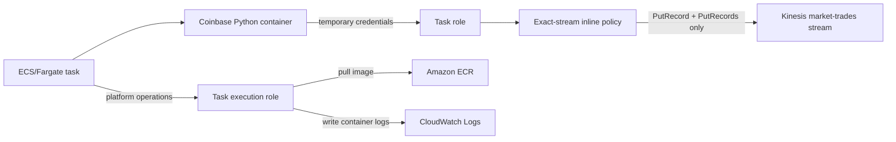

# ECS IAM Architecture Interview Guide

**Owner:** Paresh Ranjan Rout

**Completed scope:** ECS task role, least-privilege Kinesis producer policy, policy simulation and ECS task execution role

**Practice standard:** Beginner, Medium and Company-scale Scenario

> Company names describe interview-scale scenarios only. They do not claim those companies use this exact architecture.

## Architecture learned in this milestone

The task role is the application identity. The execution role is the ECS/Fargate platform identity. Both trust `ecs-tasks.amazonaws.com`, but they are placed in different fields of the ECS task definition and carry different permission policies.

## Architecture answer framework

1. Identify the calling principal.
2. Separate trust from permissions.
3. List the minimum actions required.
4. Restrict the resource ARN and Region.
5. Prefer temporary role credentials over static keys.
6. Test both an expected allow and an expected deny.
7. Distinguish policy simulation from runtime proof.

## Mode 1 — Beginner

### 1. What is an IAM role?

**Strong answer:** An IAM role is an AWS identity with permissions that an approved principal can assume temporarily. It does not require permanent access keys.

### 2. What is the ECS task role?

**Strong answer:** It is the identity available to application code inside the container. In this project, the Coinbase adapter uses it to call `PutRecord` or `PutRecords` on one Kinesis stream.

### 3. What is the ECS task execution role?

**Strong answer:** It is used by the ECS/Fargate agent to prepare and operate the task, such as pulling a private ECR image and delivering container logs to CloudWatch. Its credentials are not the application's Kinesis permissions.

### 4. Why are the task role and execution role separate?

**Strong answer:** They represent different callers. Separating them limits blast radius, makes auditing clearer and prevents the application from receiving platform permissions it does not need.

### 5. What does a trust policy answer?

**Strong answer:** It answers “who may assume this role?” Both project roles trust the ECS task service principal through `sts:AssumeRole`.

### 6. What does a permissions policy answer?

**Strong answer:** It answers “what may the assumed role do, and on which resources?” The task role can write only to the named development Kinesis stream.

### 7. What is an ARN?

**Strong answer:** An Amazon Resource Name uniquely identifies an AWS resource. Using the exact stream ARN prevents the role from writing to every stream in the account.

### 8. Why do we not store AWS access keys in the container?

**Strong answer:** ECS supplies short-lived role credentials automatically. Static keys are harder to rotate, easier to leak and unnecessary for an AWS-hosted task.

## Mode 2 — Medium

### 1. Why did the first policy simulation return `ImplicitDeny` for resource `*`?

**Strong answer:** The allow statement matched only the exact stream ARN. Testing `*` did not match that resource, so the default IAM decision was deny. That negative result proved wildcard access was not granted.

### 2. What did the positive policy simulation prove?

**Strong answer:** It proved the task role's identity policy allowed `PutRecord` and `PutRecords` when evaluated against the exact stream ARN. It did not prove that ECS could assume the role or that a real network/API call would succeed.

### 3. Why grant both `PutRecord` and `PutRecords`?

**Strong answer:** `PutRecord` supports a single-record path or controlled smoke test. `PutRecords` supports efficient batching. Neither grants read, administrative, encryption or capacity-management access.

### 4. What is the difference between an inline and a managed policy?

**Strong answer:** An inline policy has a one-to-one lifecycle with the role. A managed policy is a reusable standalone policy that can attach to multiple identities. The narrow application permission is inline here; AWS supplies a managed execution policy for standard ECS operations.

### 5. Why is `iam:PassRole` not attached to the application task role?

**Strong answer:** `iam:PassRole` belongs to the deployment identity that registers or launches an ECS task with the roles. The running application does not need authority to pass roles to AWS services.

### 6. How are temporary credentials delivered to an ECS task?

**Strong answer:** ECS obtains role credentials through AWS STS and exposes them through the container credential provider. AWS SDKs such as Boto3 discover and refresh them automatically.

### 7. Does `AmazonECSTaskExecutionRolePolicy` allow the application to write to Kinesis?

**Strong answer:** No. It supports standard execution needs such as ECR image retrieval and CloudWatch log delivery. The task role separately grants the application's Kinesis actions.

### 8. When is the IAM milestone truly production-verified?

**Strong answer:** After static policy checks plus runtime evidence: ECS successfully assumes both roles, pulls the image, emits logs, writes only to the intended stream and fails an unauthorized-resource test without exposing credentials.

## Mode 3 — Company-scale scenarios

### 1. AWS-style multi-tenant platform

**Question:** Hundreds of ECS services use one shared task role with access to every stream. What would you change?

**Strong answer direction:** Give workloads separate roles or tightly governed reusable roles, scope actions and ARNs to each data product, add permission boundaries/SCPs where appropriate and audit CloudTrail activity. Shared wildcard roles create an excessive blast radius.

### 2. Netflix-like telemetry surge

**Question:** The producer is throttled during a major release. Should you add Kinesis administrative permissions to its task role so it can add shards?

**Strong answer direction:** No. Keep data-plane writing separate from control-plane scaling. A deployment/operations role or automatic capacity mechanism should manage shards. The application handles backpressure and reports metrics without becoming a stream administrator.

### 3. LinkedIn-like activity platform

**Question:** One service produces events while another consumes them. Should they share a role?

**Strong answer direction:** Prefer separate producer and consumer roles. The producer receives `PutRecord(s)`; the consumer receives only the required read operations and checkpoint permissions. Separation improves least privilege, ownership and auditability.

### 4. Databricks-like cross-account processing

**Question:** A lakehouse job in another AWS account must consume the stream. Is the current task role sufficient?

**Strong answer direction:** No. Design a separate cross-account consumer identity, resource policy and—because cross-account encrypted sharing is required—evaluate a customer-managed KMS key with compatible key policies. Test both account and key authorization paths.

### 5. Walmart-like environment separation

**Question:** Development code must never write to the production order stream. How would you enforce it?

**Strong answer direction:** Use separate accounts where possible, environment-specific roles and exact resource ARNs, plus SCPs or permission boundaries that deny production resources from development principals. Test explicit negative paths in CI and deployment gates.

### 6. FAANG-scale compromised container

**Question:** An attacker gains code execution inside the Coinbase container. What can they access?

**Strong answer direction:** They inherit only the task role's temporary permissions: writing to the exact development stream. They should not read streams, manage IAM, retrieve unrelated secrets or access other resources. Reduce session exposure, monitor anomalous writes and revoke/stop tasks during response.

### 7. Execution-role failure

**Question:** The task remains in `PROVISIONING` and reports an image-pull error. Which role do you investigate first?

**Strong answer direction:** Inspect the task execution role, ECR repository access, network path and image reference. The application task role is not used to pull the image.

### 8. Policy simulation passes but runtime fails

**Question:** `PutRecords` is Allowed in the simulator, but the running task receives `AccessDenied` or cannot connect. What do you check?

**Strong answer direction:** Confirm the task definition references the correct task role, inspect CloudTrail denial context, check SCPs, permission boundaries, resource policies, Region/ARN mismatch and credential source. For timeouts, check DNS, routing, security groups and VPC endpoints rather than assuming IAM is the cause.

## Interview completion checklist

- Explain task role versus execution role without mixing the callers.
- Explain trust policy versus permission policy.
- Draw the runtime temporary-credential path.
- Scope a producer policy to actions, Region and exact stream ARN.
- Explain explicit allow, implicit deny and explicit deny precedence.
- Separate application data-plane access from platform/control-plane access.
- State why policy simulation is necessary but insufficient for runtime proof.
- Diagnose whether a failure belongs to IAM, ECR, networking, ECS or Kinesis.

## AWS references

- [Amazon ECS task IAM role](https://docs.aws.amazon.com/AmazonECS/latest/developerguide/task-iam-roles.html)
- [Amazon ECS task execution IAM role](https://docs.aws.amazon.com/AmazonECS/latest/developerguide/task_execution_IAM_role.html)
- [Best practices for IAM roles in Amazon ECS](https://docs.aws.amazon.com/AmazonECS/latest/developerguide/security-iam-roles.html)
- [IAM policy evaluation logic](https://docs.aws.amazon.com/IAM/latest/UserGuide/reference_policies_evaluation-logic.html)

Continue with the broader container-runtime questions in [`11-ecs-ecr-fargate-data-engineering-architecture-interview-guide.md`](11-ecs-ecr-fargate-data-engineering-architecture-interview-guide.md).
