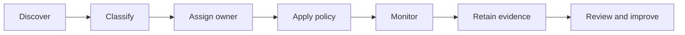

# Governance Operating Model

Governance is a design constraint and an automated operating practice—not a final documentation step.

## Governance lifecycle

## Accountable roles

| Role | Accountability |
|---|---|
| Platform owner — Paresh Ranjan Rout | Architecture integrity, roadmap, SLOs, cost, and final technical recommendation |
| Data product owner | Business purpose, consumers, retention, and quality expectations |
| Data steward | Classification, definitions, quality rules, and remediation |
| Data engineer | Contracts, pipelines, tests, lineage, and operational evidence |
| Security owner | Threat model, access, encryption, incident controls, and exceptions |
| Cloud/platform engineer | Accounts, network, IaC, deployment, observability, and recovery |
| Consumer owner | Approved use, query behavior, downstream quality, and AI safeguards |

## Data classification

| Class | Examples | Minimum controls |
|---|---|---|
| Public | Published market prices | Integrity, source attribution, encryption, retention |
| Internal | Pipeline metrics and non-sensitive operational metadata | Authenticated access, encryption, logging |
| Confidential | Customer/business data and proprietary metrics | Least privilege, masking, monitored access, approved sharing |
| Restricted | Credentials, regulated identifiers, high-impact secrets | Never in event payload/logs by default; tokenization, strict roles, explicit approval |

## Policy by lifecycle

| Lifecycle stage | Required governance |
|---|---|
| Source onboarding | Owner, lawful purpose, source terms, classification, schema, retention, volume, replay capability |
| Ingestion | Schema enforcement, identity, encryption, least privilege, rejection path, operational metrics |
| Bronze | Immutable raw history, restricted access, retention and legal-hold policy |
| Silver | Quality rules, standard definitions, deduplication, lineage, reproducibility |
| Gold | Business owner, SLA, approved metric definition, consumer access, versioning |
| ML/AI | Approved dataset, purpose limitation, evaluation, privacy, human oversight, output monitoring |

## Required artifacts

- source registration and data contract;
- classification and threat model;
- ADRs and architecture diagram;
- IAM and Lake Formation access matrix;
- schema compatibility and data-quality results;
- lineage and reconciliation evidence;
- retention and deletion policy;
- SLO dashboard, alerts, and runbook;
- cost estimate and allocation tags;
- approval-gate record.
