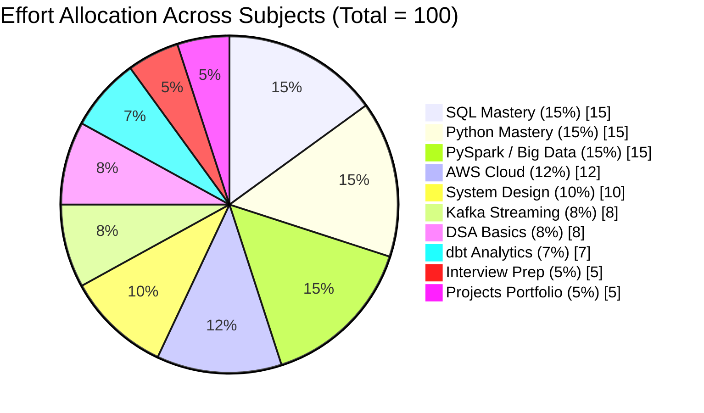

<div align="center">


<a href="https://github.com/PARESHRANJAN299/TRANSFORMATION-PLAN-AI_-_Data_Engineering_25_Lakhs">
  
</a>

<br/>


</div>

---

## 📖 Table of Contents

- [🚀 About This Roadmap](#-about-this-roadmap)
- [🗺️ 6-Month Roadmap (Phase-wise)](#️-6-month-roadmap-phase-wise)
- [📊 Effort Allocation — Out of 100 per Subject](#-effort-allocation--out-of-100-per-subject)
- [🥧 Effort Distribution Chart](#-effort-distribution-chart)
- [🧰 Tech Stack](#-tech-stack)
- [📁 Repository Structure](#-repository-structure)
- [✅ Milestone Tracker](#-milestone-tracker)
- [📈 Live Activity](#-live-activity)

---

## 🚀 About This Roadmap

> **Mission:** Build the **SAT (Secure Device Intelligence Platform)** foundation while executing a structured **6-month transformation** into a skilled **Data Engineer**, across **Robotics, ML, AI, IoT, and Big Data**.

This repository is my single source of truth — every subject, every day of practice, every project, and every ounce of effort is tracked here, road-wise, subject-wise, and percentage-wise.

---

## 🗺️ 6-Month Roadmap (Phase-wise)

```mermaid
flowchart LR
    Start((🚩 Start\nJan 20, 2025)) --> P1

    subgraph P1[" Phase 1 · Foundations "]
        direction TB
        A1[01_SQL_Master]
        A2[02_Python_Master]
        A3[05_DSA_Basics]
    end

    P1 --> P2

    subgraph P2[" Phase 2 · Big Data Engines "]
        direction TB
        B1[03_PySpark_Master]
        B2[Databricks Certification]
    end

    P2 --> P3

    subgraph P3[" Phase 3 · Cloud and Streaming "]
        direction TB
        C1[06_AWS_Cloud]
        C2[07_Kafka_Streaming]
    end

    P3 --> P4

    subgraph P4[" Phase 4 · Analytics Engineering "]
        direction TB
        D1[08_dbt_Analytics]
        D2[04_System_Design]
    end

    P4 --> P5

    subgraph P5[" Phase 5 · Career Launch "]
        direction TB
        E1[09_Interview_Preparation]
        E2[10_Projects_Portfolio]
    end

    P5 --> Goal((🎯 Skilled\nData Engineer))

    style Start fill:#0f2027,stroke:#00c9ff,color:#fff
    style Goal fill:#00c9ff,stroke:#0f2027,color:#000
```



---

## 📊 Effort Allocation — Out of 100 per Subject

Every subject is weighted **out of 100** based on interview impact, real-world usage, and depth required to become job-ready.

| # | Subject | Folder | Effort / 100 | Progress |
|---|---------|--------|:---:|---|
| 1 | 🟦 SQL Mastery | `01_SQL_Master` | **15** |  |
| 2 | 🐍 Python Mastery | `02_Python_Master` | **15** |  |
| 3 | 🔥 PySpark / Big Data | `03_PySpark_Master` | **15** |  |
| 4 | ☁️ AWS Cloud | `06_AWS_Cloud` | **12** |  |
| 5 | 🏗️ System Design | `04_System_Design` | **10** |  |
| 6 | 📡 Kafka Streaming | `07_Kafka_Streaming` | **8** |  |
| 7 | 🧮 DSA Basics | `05_DSA_Basics` | **8** |  |
| 8 | 🧱 dbt Analytics | `08_dbt_Analytics` | **7** |  |
| 9 | 🎤 Interview Prep | `09_Interview_Preparation` | **5** |  |
| 10 | 📦 Projects Portfolio | `10_Projects_Portfolio` | **5** |  |
| | | **Total** | **100** | |

---

## 🥧 Effort Distribution Chart



---

## 🧰 Tech Stack

<div align="center">


</div>

---

## 📁 Repository Structure

```
TRANSFORMATION-PLAN-AI_-_Data_Engineering_25_Lakhs/
├── 01_SQL_Master/                          # Phase 1 · Day-wise SQL curriculum + guides
├── 02_Python_Master/                       # Phase 1 · Python for Data Engineering
├── 03_PySpark_Master/                      # Phase 2 · Distributed data processing
├── 04_System_Design/                       # Phase 4 · Engineering fundamentals
├── 05_DSA_Basics/                          # Phase 1 · Core data structures & algorithms
├── 06_AWS_Cloud/                           # Phase 3 · Cloud infrastructure
├── 07_Kafka_Streaming/                     # Phase 3 · Real-time streaming
├── 08_dbt_Analytics/                       # Phase 4 · Analytics engineering
├── 09_Interview_Preparation/                # Phase 5 · Interview readiness
├── 10_Projects_Portfolio/                  # Phase 5 · Sales Reporting, US Holiday, and more
├── Databricks_Learning/                    # Bonus · DE Associate Certification (15-day track)
└── Roadmap Data Engineering all Subjects2026/  # Master roadmap reference
```

---

## ✅ Milestone Tracker

- [x] Phase 1 — SQL Mastery, Python Mastery, DSA Basics
- [ ] Phase 2 — PySpark Mastery, Databricks Certification
- [ ] Phase 3 — AWS Cloud, Kafka Streaming
- [ ] Phase 4 — dbt Analytics, System Design
- [ ] Phase 5 — Interview Preparation, Projects Portfolio
- [ ] 🎯 Final Goal — Data Engineer Role

---

## 📈 Live Activity

<div align="center">


</div>

<div align="center">

**Built with consistency, one commit at a time. 🚀**


</div>
